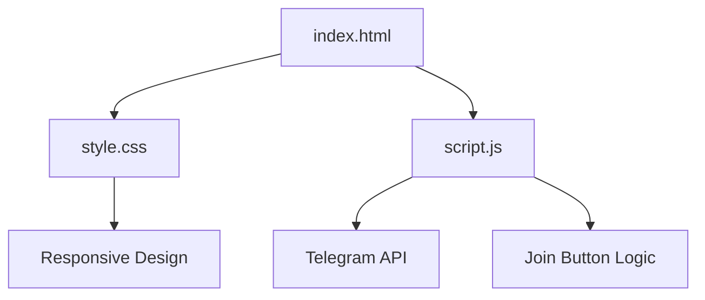

# Tip Me a Dollar - Telegram Mini App

[](https://opensource.org/licenses/MIT)
[](https://t.me/likhondotxyz)

A web application designed to connect users with our Telegram community. The app features a join button that opens a popup inviting users to stay updated via Telegram.

[🌐 Live Demo](https://tipmedoller-twa.vercel.app/)

## 📊 Repository Details

- 📂 [likhonsheikhorg/tipmedoller-twa](https://github.com/likhonsheikhorg/tipmedoller-twa)
- ⭐ Stars: 0
- 🍴 Forks: 0
- 👀 Watching: 0
- 🌿 Branches: 1
- 🏷️ Tags: 0

## 🚀 Features

- 🔘 Join Button: Fixed at the bottom right, opens a popup to join our Telegram group.
- 💬 Popup: Styled popup for joining the Telegram community.
- 📱 Responsive Design: Compatible with various devices and screen sizes.

## 🏁 Quick Start

Clone the repository and open `index.html`:

```bash
git clone https://github.com/likhonsheikhorg/tipmedoller-twa.git
cd tipmedoller-twa
# Open index.html in your browser
```

## 📈 Project Structure



## 🤝 Contributing

We welcome contributions! Feel free to fork the repository and submit pull requests for improvements.

## 📜 License

This project is licensed under the MIT License - see the [LICENSE](LICENSE) file for details.

## 📞 Contact

For inquiries or support, reach out to us on [Telegram](https://t.me/likhondotxyz).

---

## 👤 About the Developer

Likhon Sheikh

- 🌐 Web: [likhon.xyz](https://likhon.xyz)
- 📱 Telegram: [@nectariferous](https://t.me/nectariferous)
- 📧 Email: owner@likhon.xyz

© All rights reserved.

---

Thank you for visiting **Tip Me a Dollar**! We appreciate your interest and support.
